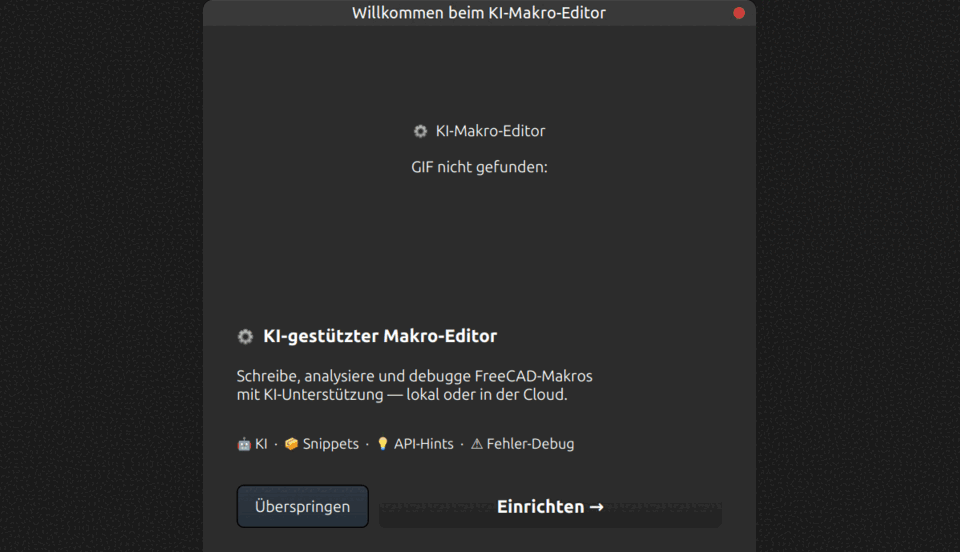

# FreeCAD MultiAI Panel

Ein moderner, KI-gestützter Python-Editor als FreeCAD-Plugin mit frei anordenbaren Panels,
Syntax-Highlighting, 19 unterstützten KI-Anbietern und umfangreichen Werkzeugen zur
FreeCAD-Automatisierung.

---

## Vorschau



> *Tool zur Aufnahme: [Peek](https://github.com/phw/peek) unter Linux*

---

## Quick Start

1. **Pflicht-Paket installieren:** `pip install requests`
2. **Repo klonen/herunterladen** und in den FreeCAD-`Mod`-Ordner legen (Ordnername: `FreeCAD_MultiAI_Panel`, ohne Leerzeichen)
3. **FreeCAD neu starten** und die Workbench **„FreeCAD MultiAI Panel"** auswählen
4. **KI-Anbieter einrichten** im Begrüßungs-Dialog (z. B. lokal mit Ollama oder mit eigenem API-Key) – fertig!

> Details zu den Pfaden je Betriebssystem (Linux/Flatpak/Windows/macOS) findest du unter [Voraussetzungen & Installation](#voraussetzungen--installation).

---

## Inhaltsverzeichnis

- [Features im Überblick](#features-im-überblick)
- [Voraussetzungen & Installation](#voraussetzungen--installation)
- [KI-Anbieter einrichten](#ki-anbieter-einrichten)
- [Erststart & Willkommen-Dialog](docs/erststart.md)
- [Die Benutzeroberfläche](docs/oberflaeche.md)
- [Panels im Detail](docs/panels.md)
- [KI-Workflow & Presets](docs/ki-workflow.md)
- [FC11, FC12 & FC13 – Makro aus Beschreibung](docs/makro-generator.md)
- [Snippets, API-Hints & Werkzeuge-Panel](docs/snippets-und-werkzeuge.md)
- [Makro-Bibliothek](docs/makro-bibliothek.md)
- [Fehler-Übersetzer & Backup-System](docs/fehler-und-backup.md)
- [Ollama – Erfahrungsbericht](docs/OLLAMA_ERFAHRUNGEN.md)
- [Tastenkürzel](#tastenkürzel)
- [Projektstruktur](#projektstruktur)
- [Bekannte Einschränkungen](#bekannte-einschränkungen)
- [Lizenz](#lizenz)

---

## Features im Überblick

### Editor
- Mehrere Dateien gleichzeitig als Tabs mit Drag & Drop
- Python-Syntax-Highlighting (automatisch hell/dunkel-adaptiv)
- Zeilennummern, Einrückungs-Guides, Cursor-Position
- Jedi-basierte Autovervollständigung (optional)
- Suche & Ersetzen mit Strg+F
- Unbegrenzte Undo/Redo-Transaktionen
- Automatische Backups vor jeder KI-Ersetzung (max. 3 je Datei)
- autopep8-Formatierung (optional)

### KI-Integration
- **19 KI-Anbieter** unterstützt (Ollama, Claude, ChatGPT, Gemini, DeepSeek, Groq …)
- **40+ Presets** für alle gängigen Code-Aufgaben
- Streaming-Antworten in Echtzeit (50 ms Chunk-Batching)
- Chat-Verlauf mit Auto-Kompacting ab 5 000 Zeichen
- Zwei Modi: 🟢 Anfänger (ausführlich, Deutsch) / 🔵 Experte (knapp, technisch)
- Makro aus natürlichsprachlicher Beschreibung generieren (FC11 / FC12 / FC13)
- KI-Tool-Calling für strukturierte FreeCAD-Operationen

### Benutzeroberfläche
- 13 frei anordnbare Dock-Panels (verschieben, abdocken, zu Tabs zusammenfassen)
- **Hell- und Dunkel-Modus** umschaltbar per 🌙/☀-Button in den Einstellungen, Auswahl wird gespeichert
- Alle Panels einzeln per Toolbar ein-/ausschaltbar
- Begrüßungs-Dialog bei Erststart (KI-Anbieter direkt einrichten)
- **🤝 Interaktiver Assistent** – Fragen stellen, KI antwortet mit Schritt-für-Schritt-Anleitung und lässt Buttons aufleuchten
- **♿ Barrierefreiheit** – Schrift, Kontrast, Tastaturmodus (Alt+1–0), Einfache Ansicht, Tooltip-Delay, Animationen

---

## Voraussetzungen & Installation

### Voraussetzungen
- **FreeCAD 0.21** oder neuer
- **Python 3.10+**

### Pflicht-Paket
```bash
pip install requests
```
*Wird für alle KI-Anbindungen benötigt. Ohne `requests` startet der Editor, alle KI-Funktionen sind aber deaktiviert.*

### Optionale Pakete
```bash
pip install jedi            # Python-Autovervollständigung im Editor
pip install autopep8        # automatische PEP-8-Formatierung (Button wechselt zu "✨ autopep8")
pip install pyspellchecker  # Rechtschreibprüfung im Helfer-Panel (reines Python, Flatpak-kompatibel)
```

Alle auf einmal:
```bash
pip install requests jedi autopep8 pyspellchecker
```

> **Flatpak-Nutzer:** Pakete müssen über das eingebettete Python installiert werden:
> ```bash
> flatpak run --command=python3 org.freecad.FreeCAD -m pip install pyspellchecker
> ```

> **FreeCAD AppImage / Flatpak:** Nach `pip install` FreeCAD neu starten.
> Bei AppImages muss `pip` ggf. gegen das eingebettete Python gerichtet werden:
> `/path/to/FreeCAD.AppImage --appimage-extract` → Python aus dem extrahierten Verzeichnis verwenden.

### Plugin installieren

1. Dieses Repository klonen oder als ZIP herunterladen und entpacken
2. Den Ordner umbenennen in `FreeCAD_MultiAI_Panel` (ohne Leerzeichen – wichtig!)

#### Linux – AppImage

```bash
mkdir -p ~/.local/share/FreeCAD/v1-1/Mod
ln -s /pfad/zum/FreeCAD_MultiAI_Panel ~/.local/share/FreeCAD/v1-1/Mod/FreeCAD_MultiAI_Panel
```

#### Linux – Flatpak

```bash
mkdir -p ~/.var/app/org.freecad.FreeCAD/data/FreeCAD/v1-1/Mod
ln -s /pfad/zum/FreeCAD_MultiAI_Panel ~/.var/app/org.freecad.FreeCAD/data/FreeCAD/v1-1/Mod/FreeCAD_MultiAI_Panel
```

> **Tipp:** Mit einem Symlink (`ln -s`) bleibt der Ordner am ursprünglichen Speicherort – Änderungen am Code werden sofort wirksam ohne erneutes Kopieren.

> **Flatpak Dateizugriff:** Falls die Workbench im Flatpak nicht lädt, muss FreeCAD Zugriff auf den Home-Ordner erhalten:
> ```bash
> flatpak override --user --filesystem=home org.freecad.FreeCAD
> ```

#### Windows

```
%APPDATA%\FreeCAD\Mod\FreeCAD_MultiAI_Panel\
```

#### macOS

```
~/Library/Preferences/FreeCAD/Mod/FreeCAD_MultiAI_Panel/
```

> **Wichtig für Linux:** FreeCAD 1.x speichert Benutzerdaten unter `v1-1/` – ältere Anleitungen ohne diesen Unterordner funktionieren nicht.

3. FreeCAD neu starten → die Workbench **„FreeCAD MultiAI Panel"** erscheint im Workbench-Menü

---

## KI-Anbieter einrichten

### Unterstützte Anbieter (19)

| Anbieter | Modelle (Auswahl) | API-Key Format |
|----------|-------------------|----------------|
| **Ollama** (lokal) | codellama, llama3, mistral, … | — (kein Key) |
| **Anthropic (Claude)** | claude-opus-4-6, claude-sonnet-4-6, claude-haiku-4-5 | `sk-ant-…` |
| **OpenAI (ChatGPT)** | gpt-4o, gpt-4o-mini, gpt-4-turbo | `sk-…` |
| **GitHub Copilot** | gpt-4o, gpt-4o-mini, o1-mini | `ghp_…` |
| **DeepSeek** | deepseek-coder, deepseek-chat, deepseek-reasoner | API-Key |
| **Gemini (Google)** | gemini-2.0-flash, gemini-1.5-pro, gemini-1.5-flash | API-Key |
| **Groq** | llama-3.3-70b, mixtral-8x7b, gemma2-9b | API-Key |
| **Mistral** | mistral-large-latest, codestral-latest | API-Key |
| **Together AI** | llama-3.3-70B, mixtral-8x7B, CodeLlama-34b | API-Key |
| **HuggingFace** | Llama 3.2, Qwen2.5-Coder, Mistral | API-Key |
| **xAI (Grok)** | grok-3, grok-3-mini, grok-2 | API-Key |
| **Fireworks AI** | llama-v3p3-70b, deepseek-coder-v2 | API-Key |
| **Moonshot** | moonshot-v1-8k, v1-32k, v1-128k | API-Key |
| **Qwen (Alibaba)** | qwen-coder-plus, qwen-plus, qwen-max, qwen2.5-coder-32b | API-Key |
| **Cohere** | command-a-03-2025, command-r-plus, command-r | API-Key |
| **SambaNova** | DeepSeek-R1, Meta-Llama-3.3-70B, Qwen2.5-Coder | API-Key |
| **MiniMax** | — | API-Key |
| **Llama API** | — | API-Key |
| **OpenRouter** | (alle unterstützten Modelle) | `sk-or-…` |

### Ollama (lokal, kostenlos)
```bash
# 1. Ollama installieren: https://ollama.ai
# 2. Modell herunterladen
ollama pull codellama
# oder
ollama pull llama3

# 3. Ollama-Dienst starten (läuft auf http://localhost:11434)
ollama serve
```
Im Editor: **⚙ Einstellungen** → Quelle: `Ollama (Lokal)` → kein API-Key nötig → **🔄 Modelle neu laden**

### Anthropic / OpenAI / weitere Cloud-Anbieter
Im Editor: **⚙ Einstellungen** → Anbieter wählen → API-Schlüssel eingeben → **Tab drücken** (wird automatisch in den FreeCAD-Einstellungen gespeichert)

### OpenRouter
```bash
# Umgebungsvariable vor FreeCAD-Start setzen
export OPENROUTER_API_KEY=sk-or-...
```

> ⚠️ **Sicherheitshinweis:** API-Schlüssel werden unverschlüsselt in den FreeCAD-Einstellungen gespeichert. Keine Produktions-Schlüssel verwenden.

---

## Tastenkürzel

| Kürzel | Aktion |
|--------|--------|
| **Strg+S** | Speichern |
| **Strg+A** | Alles auswählen |
| **Strg+Z** | Rückgängig |
| **Strg+Y** | Wiederholen |
| **Strg+F** | Suche/Ersetzen ein-/ausblenden |
| **Tab** | Autovervollständigung bestätigen |
| **Escape** | Autovervollständigung schließen |
| **Strg+Enter** | Fehler-Übersetzer: sofort übersetzen |

---

## Projektstruktur

```
FreeCAD MultiAI Panel/
│
├── main.py              # Einstiegspunkt (FreeCAD-Makro / Seitenleiste)
├── InitGui.py           # FreeCAD-GUI-Integration (Toolbar-Button)
├── Icon.svg             # Plugin-Icon
├── README.md
│
├── core/
│   ├── theme.py         # Stylesheets & Design-Funktionen (hell/dunkel-adaptiv)
│   ├── farben.py        # Explizite Farbdefinitionen für Hell- und Dunkel-Modus
│   ├── highlighter.py   # Python-Syntax-Highlighter
│   ├── schrift.py       # Schriftgrößen-Konstanten
│   ├── params.py        # Einstellungs-Persistenz (FreeCAD-Parameter)
│   └── qt_compat.py     # PySide6-Kompatibilitäts-Layer
│
├── editor/
│   ├── editor.py        # Hauptfenster (QMainWindow + 13 Dock-Panels + Toolbar)
│   ├── widgets/
│   │   ├── editor_widgets.py   # CodeEditor, LinksTextEdit, LineNumberArea
│   │   └── …
│   ├── controller/
│   │   ├── aktionen_sidebar.py   # Aktionen-Panel (Rechte Werkzeug-Leiste)
│   │   ├── bibliothek_tab.py     # Makro-Bibliothek
│   │   ├── browser_controller.py # Datei-Browser
│   │   ├── hints_controller.py   # API-Hints
│   │   ├── ki_tools_tab.py       # Tools-Panel (Direktoperationen + Protokoll)
│   │   ├── snippet_controller.py # Snippets (lokal + online + Info-Banner)
│   │   ├── suche_controller.py   # Suche & Ersetzen
│   │   ├── vorschau_controller.py
│   │   └── werkzeuge.py          # Werkzeuge-Panel (Code-Baum, Edit, Check)
│   ├── fehler/
│   │   └── fehler_panel.py       # Fehler-Übersetzer + KI-Korrektur
│   └── ki/
│       ├── ki_mixin.py           # KI-Workflow (Laden, Fragen, Ersetzen …)
│       ├── ki_backends.py        # Stream-Backends (19 Anbieter)
│       └── …
│
├── ui/
│   ├── begruessung.py   # Willkommens-Dialog (Erststart, Anbieter einrichten)
│   ├── manager.py       # FreeCAD Makro-Manager
│   └── fehler.py        # Fehler-Anzeige
│
├── data/
│   ├── freecad_data.py  # Snippets (6 Kategorien) + API-Hints
│   ├── nl_generator.py  # System-Prompts für FC11/FC12/FC13 (NL → FreeCAD-Code)
│   ├── hilfe_texte.py   # Eingebaute Hilfetexte (17 Abschnitte)
│   └── hilfe.py         # Hilfe-Panel
│
├── assets/
│   └── …                # Icons, Demo-GIF
│
├── docs/
│   └── …                # Ausführliche Dokumentation, siehe unten
│
└── tests/               # Unit-Tests
```

---

## Bekannte Einschränkungen

| Problem | Ursache | Lösung |
|---------|---------|--------|
| **Emojis als Umriss** im Flatpak | Flatpak-Sandbox blockiert System-Emoji-Fonts | Nativer Paket / AppImage verwenden |
| **FC12 bei Ollama gesperrt** | Zu komplex für lokale Modelle | Claude (Anthropic) oder GPT-4o verwenden |
| **API-Keys unverschlüsselt** | FreeCAD-Einstellungen haben keine Verschlüsselung | Keine Produktions-Keys verwenden |
| **Große Dateien (>2000 Zeilen)** | KI-Kontextfenster begrenzt | Nur relevante Abschnitte ins Eingabefeld laden |
| **Ollama nicht gefunden** | Dienst läuft nicht | `ollama serve` im Terminal starten |

---

